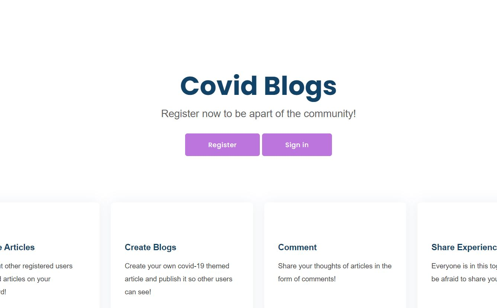

# CovidBlogs
Covid Blogs is a website that enables people to converse, share their experiences, and much more in the form of blogs.

**Link to project:** https://covid-community-blog.herokuapp.com/

## How It's Made:

**Tech used:** HTML, CSS, Ejs, Express, MongoDB, Nodejs

## Lessons Learned:

- Authentication using Passport
- Handling requests and responses
- Schema creation using Mongoose
- CRUD operations

